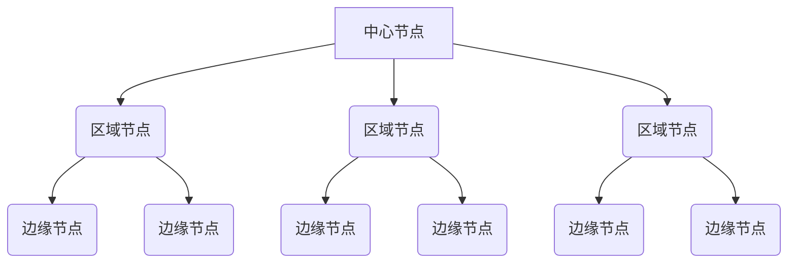

# CDN 基础
## 概念

### CDN 分发架构

全球有许多数据中心，不管在哪，不远处基本上都有数据中心。

可以在这些数据中心中部署一些机器，形成一个缓存的集群来缓存部分数据，这样用户访问的时候，就可以就近访问了。

这些分布在各个数据中心的节点,被称为`边缘节点`。

由于边缘节点数量很多，但每个集群规模比较小，不可能缓存下所有东西，也就会有无法命中的情况，测试在边缘节点之上有规模更大的`区域节点`，缓存的数据更多，命中率也更大。在区域节点之上还有`中心节点`缓存的数据进一步加大。如果还未命中就只好回源网站访问了。

如图所示，就是 CDN 的分发系统架构。 CDN 缓存是一层一层的，尽可能的不去请求源站点

### 访问边缘节点

和 DNS 的全局负载均衡类似， CDN 分发网络也是分布在多个区域、运营商的情况。

#### 没有 CDN 的情况

- 客户端访问 `xxx.com` 客户端请求本地 DNS 服务器
- 本地 DNS 如有缓存，则返回网站地址，否则递归查询到网站`权威域名服务器`
- 权威域名服务器返回 `xxx.com` 的 ip 地址，本地服务器缓存
- 本地 DNS 服务器返回给客户端 ip 地址
- 客户端直接访问 ip 地址

#### 有了 CDN

情况发生了巨大的变化

**基本流程**

- 权威 DNS 服务器会设置一个 `CNAME`, 指向另外一个域名 `xxx.cdn.com`,返回给 本地 DNS 服务器
- 本地 DNS 拿到这个域名以后，还需要继续解析这个新的域名,此时访问的就不是 `xxx.com` 的权威 DNS 服务器了,而是 `xxx.cdn.com` 的权威 DNS 服务器
- 在这服务器上还是会设置一个 `CNAME` 指向另外一个域名, 也即 CDN 网络的`全局
负载均衡器`
- 然后本地 DNS 服务器去请求 CDN 的全局负载均衡器，全局负载均衡器会选择一台最合适的缓存服务器提供服务，其主要判断指标有:
    - ip 地址 - 近距离的服务器
    - 用户所处运营商
    - URL 携带内容，判断哪个服务器缓存了所需内容
    - 当前各个服务器的负载情况
- 分析完成以后，全局服务器则会返回服务器的 ip 地址
- 本地 DNS 就会缓存这个 ip, 客户端去访问这个边缘节点，下载资源
- 如果服务器上并没有用户所需的资源，则向`上级`缓存服务器请求内容，直至到`源服务器`，将内容获取

## 存储内容

比较适合存储长时间不变的资源，比如静态页面，图片

## 其它问题
### 防盗链

#### 使用 refer 头

使用 HTTP 头的 refer 字段，浏览器发送请求，一般带上 refer 告诉服务器是从哪个页面跳转过来的，如果 refer 不是来自运行的站点，就禁止访问，

但 refer 机制很容易被破解

#### 时间戳

和 CDN 厂商规定一个加密字符串，客户端使用截止时间戳，访问的资源路径，加密字符串进行签名，得到一个新的字符串，然后生成新的访问链接，即带上签名的访问链接去访问 CDN

CDN 服务端取出截止时间，和当前 CDN 节点时间进行比较判断是否过期。除此之外还要根据相同的签名算法重新签名一遍，如果签名结果相同，才将资源返回给用户。

## 动态数据缓存

### 边缘计算模式

数据是动态生成的，数据的`逻辑计算和存储`也可以放在边缘节点上。定时从源数据同步`存储的数据`，然后在边缘节点计算得到结果。

既然没办法事先做好缓存，那就将生成逻辑直接放在用户的附近，既可以当场出结果，又能就近提供结果

### 路径优化模式

数据不在边缘生成,而是在`源站点`生成，但`数据下发确实通过 CDN 网络`,对路径进行优化。

- 由于 CDN 节点较多，能找到`离源站近`的边缘节点，也能找到离用户很久的边缘节点。中间链路完全由 CDN 来规划，选择一个更加快速，可靠的类似于`专线`的方式进行访问
- 对于 TCP 连接公网传输常会丢数据，导致 TCP 窗口始终很小，发送速度上不去。根据 TCP 的流量控制和拥塞控制原理，在 CDN 加速网络中，可以调整 TCP 参数，使得 TCP 能更加激进的传数据
- 也可以多个请求服用一个 TCP 链接，保证每次动态请求到达时，连接都已经建立了。不必临时三次握手或
者建立过多的连接，增加服务器的压力。
- 另外，可以通过对传输数据进行`压缩`，增加传输效率。
