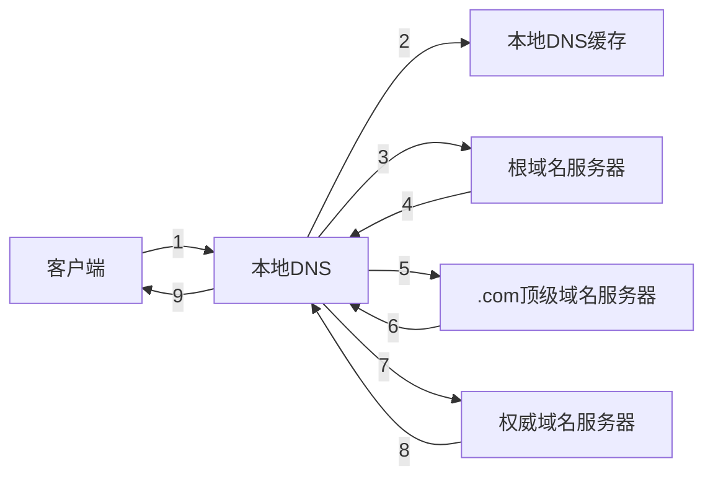
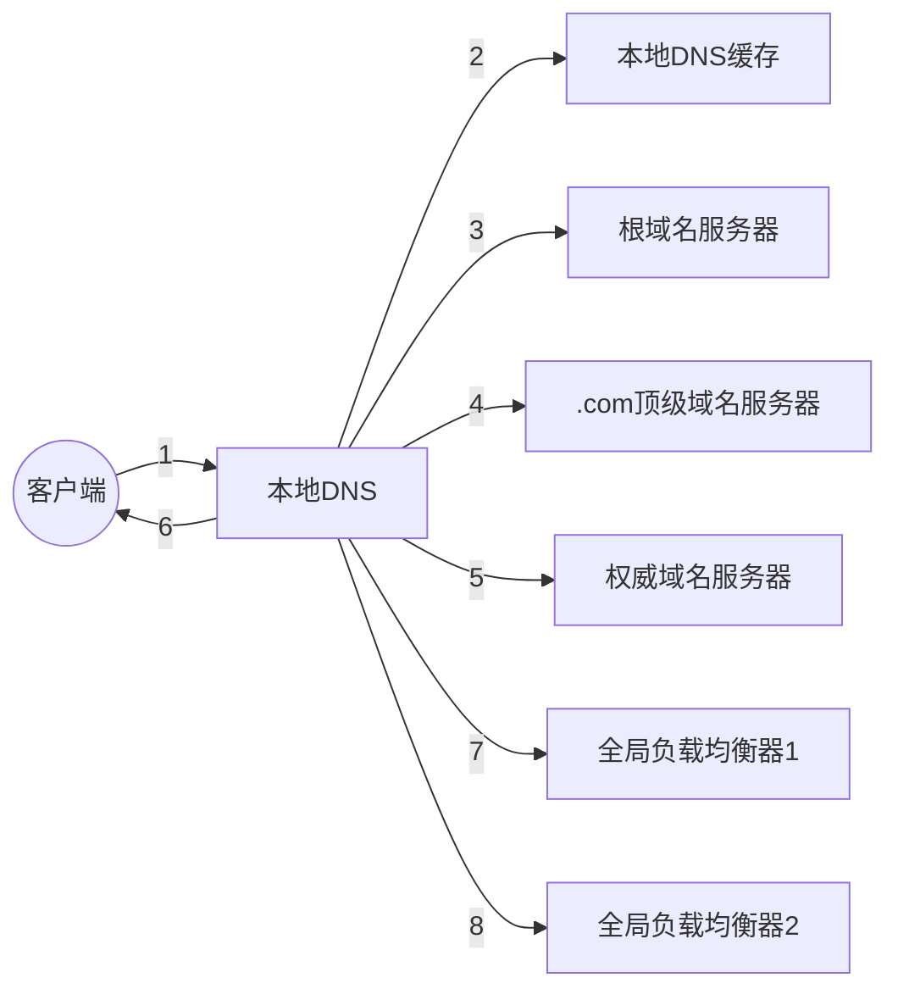

# DNS

## 解析流程

访问 www.163.com

- 客户端发送 DNS 请求给`本地域名服务器`
    - 本地域名服务器 可以是服务商提供的 也可以配置为公共 DNS
- 本地 `DNS` 收到请求后,如果在其缓存中能找到目标域名的 ip ,则直接返回 ip
    - 否则本地 DNS 回去询问根`域名服务器`
    - `根域名`不直接用于域名解析，但会返回`顶级域名服务器`的地址
    - 比如 `www.163.com` 由 `.com` 管理，返回 `.com`的顶级服务器地址
    - 顶级域名服务器负责管理二级域名
- 本地 DNS 此时就向收到的顶级域名服务器发送请求
- 顶级域名收到请求以后,返回负责 `www.163.com` 的`权威DNS服务器`的地址
- 本地 DNS 服务器又去询问权威 DNS 服务器
- 权威 DNS 服务器查询到了以后，将对应的 ip 地址返回给本地 DNS 服务器
- 本地 DNS 再将结果返回给客户端

## 负载均衡

### 本地负载均衡

>本地负载均衡针对本地范围的服务器群做负载均衡

客户端需要访问一个应用时，应该配置这个应用的`域名`而不是 `ip` 地址。如果由于一些原因改应用要换到其他的机器上，如果多个客户端都使用了这个应用，则修改起来非常麻烦。但如果配置的是域名，则修改 DNS 服务器里的`映射关系`即可。

在这基础之上,配置的应用被访问的快撑不住的时候，可以部署`多个应用`，并且在域名解析的时候，只要配置访问策略，比如说第一次返回第一个，第二次返回第二个，这样就实现了负载均衡。

### 全局均衡负载

>全局负载均(GSLB)衡针对不同地理位置、不同网络结构的服务器群做负载均衡

- 客户端访问 `aa.bb.com` 的时候,需要将域名转换为 `IP` 来进行访问
- 本地 DNS 先查看是否有缓存这个记录，如果有则直接使用，否则递归的查询一遍
- 最终会查到 `aa.bb.com` 的`权威域名服务器

对于不需要做 GSLB 的简单应用来说,权威服务器可以将这个域名解析为多个 IP 地址，客户端自己简单的轮询访问，做到均衡负载

对于复杂的，夸地区运营商的应用，则需要 GSLB 机制，因而需要专门的设备、服务器来做，这就是`全局负载均衡器`

在 `aa.bb.com` 的 DNS 中一般通过配置 `CNAME` 的方式,给 `aa.bb.com` 起一个别名，比如 `aa.xx.bb.com` 然后让 本地 DNS 服务器去请求这个域名， GSLB就可以在解析这个域名的过程中，通过自己的策略实现均衡负载

GSLB 也可以分为多层,如上图所示:

- 两层 GSLB 希望用户访问相同运营商机房中资源，不跨运营商，提高吞吐量
- 第一层 GSLB ，通过查看本地 DNS 所在运营商，就是用户所在运营商，假设是 联通 ,通过 CNAME 的方式，使用另外一个别名 `aa.lt.bb.com` 告诉本地 GSLB 去请求第二层 GSLB
- 第二层 GSLB, 通过查看本地 DNS 所在地址，就知道用户的大致地理区域，然后再找到距离用户比较近的存储节点地址，返回给本地 DNS 服务

本地 DNS 拿到结果后，返回给客户端，客户端就可以进行访问了。

