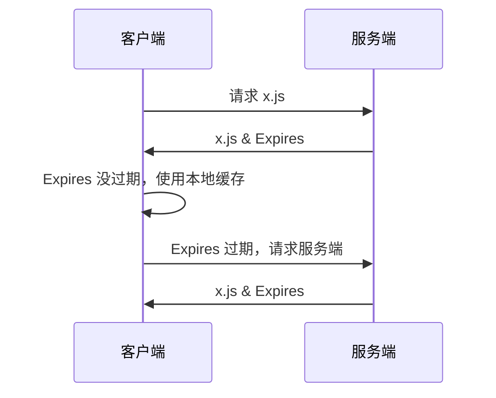
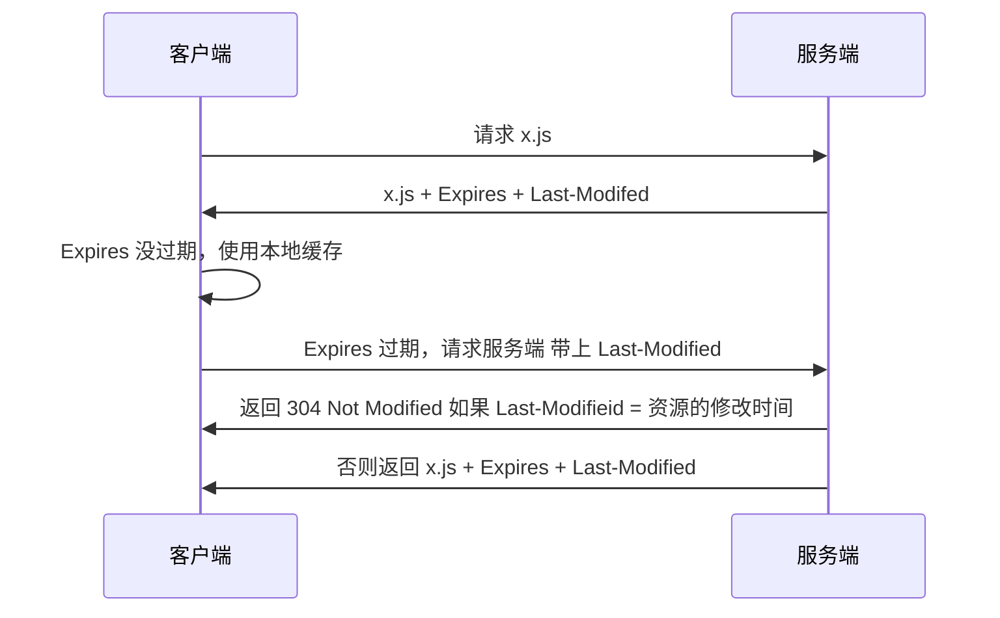
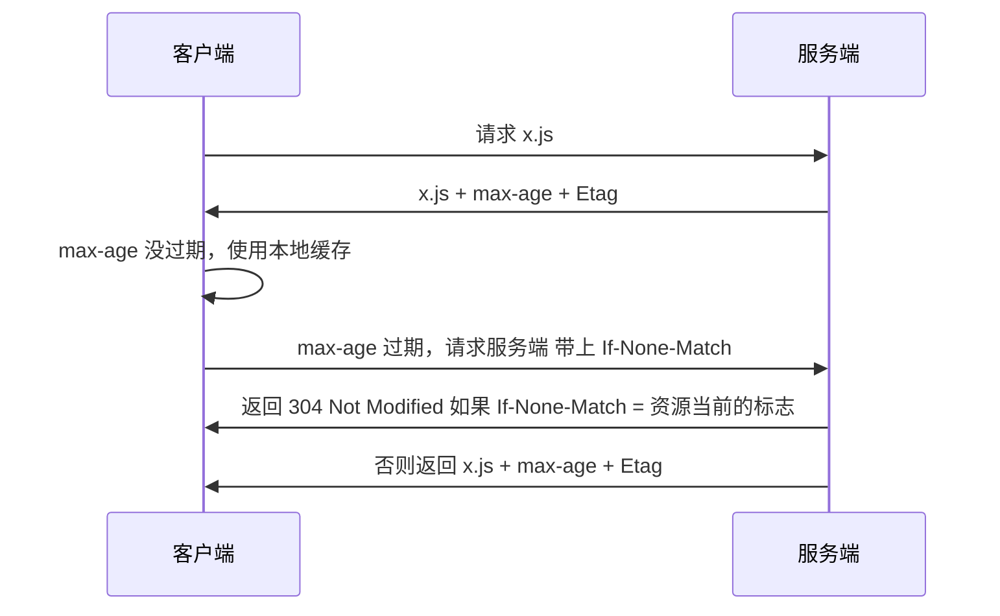

# HTTP 缓存


客户端每次都请求服务器，流量消耗大，并且服务器也有压力


缓存主要针对 `css` `js` `图片` 这些更新频率不大的静态资源文件

## 缓存头部

### Cache-Control

请求 & 响应头， 缓存控制字段


值 | 作用
-|-
no-store|所有内容不缓存
no-cache|缓存,但使用缓存之前需要请求服务器判断资源是否是最新
max-age=x(秒)|请求缓存后的x秒内不在发起请求
s-maxage=x(秒)|代理服务器请求源站缓存后x秒内不在发起请求，只对CDN有效
public|客户端和代理服务器(CDN)都可缓存
private|只有客户端可以缓存

### Expires

- 响应头
- 代表缓存资源过期时间，由服务器提供
- `HTTP1.0` 的属性, 比 `max-age` 优先级低

### Last-Modified

- 响应头
- 标识资源最新修改时间,由服务器提供

### If-Midified-Since

- 请求头
- 资源最新的修改时间
- 和 `Last-Modified` 一对,会进行对比，判断要不要重新发送资源请求

### Etag

- 响应头
- 资源唯一标识，由服务器提供

### If-None-Match

- 请求头,缓存资源标识
- 由浏览器提供给服务器 (其实就是上一次服务器给的Etag) 和 Etag 是一对，会进行比较

## 工作流程

### 服务器和浏览器约定一个过期时间 Expires

#### 流程





- 浏览器向服务器请求 `x.js` 文件
- 服务器将 `x.js` 响应回客户端,并约定一个时间 `Expires`
- 后续请求的时候，浏览器先对比一下当前时间是否大于了约定的 `Expires`
- 如果时间没过，则用本地的缓存，否则才发送请求 

#### 问题

- 如果 `Expires` 已经过期，浏览器再次请求服务器，但实际上文件并没有变化,就白请求了

### 在约定文件过期的基础上，加上最新文件修改时间 (Last-Modified & If-Modified-Since) 来进行对比

#### 流程



- 浏览器向服务器请求 `x.js` 文件
- 服务器将 `x.js` 响应回客户端,并约定一个时间 `Expires`, 并且将 `Last-Modified`带上
- 接下来就分情况了
- `Expires` 没有过期
	-  浏览器进行使用本地缓存
- `Expires` 过期以后
	- 请求资源，带上 `If-Modified-Since`
	- 服务器将 `If-Modified-Since` 的时间和文件的修改时间进行对比
	- 如果不相等，则服务器会去查找最新文件+返回`Last-Modified`
	- 如果相等，则返回 `304 Not Modified` 响应

#### 问题

- 浏览器可以随意修改 `Expires`
- 由于 `Last-Modified` 只能精确到秒,极端情况下
	- 假设文件是在 1s 内发生变化
	- 则 `Last-Modified` 无法感知文件的变化
	- 浏览器`永远拿不到`最新的文件

### 改为返回 `max-age` +  `Etag & If-None-Match`

#### 流程



- 浏览器向服务器请求 `x.js` 文件
- 服务器将 `x.js` 响应回客户端,并约定一个过期时间 `max-age`, 并且将 `Etag`带上
- 接下来就分情况了
- `max-age` 没有过期
	-  浏览器进行使用本地缓存
- `max-age` 过期以后
	- 请求资源，带上 `If-None-Match`
	- 服务器将 `If-None-Match` 的时间和文件的修改时间进行对比
	- 如果不相等，则服务器会去查找最新文件+返回新的`Etag`
	- 如果相等，则返回 `304 Not Modified` 响应
- 由于 `max-age` 优先级高于 `Expires`, `Etag` 优先级 高于 `Last-Modified`,就算添加上了第二个流程的头部，也不会起作用


### 以上方案的问题以及解决思路
#### 问题

- max-age | Expires 不过期，浏览器是没办法`主动感知`服务器的文件变化
- 从 HTTP 协议本身上就很难解决

#### 解决策略

**hash 缓存**

通过`不缓存 html` 为静态文件添加 `hash标识` 如果文件内容变动了，则文件名也变动

解决浏览器无法跳过过期时间，主动感知文件变化的问题。

从根本上解决，浏览器过期时间没到浏览器不能主动请求服务器的问题

```html
<script src="/xx-JFKDFJKKSJDKFKJSDKF.js?"></script>
```


## 浏览器的操作对缓存的影响

操作|作用
-|-
地址栏回车,页面跳转，前进后退|没啥用
F5 刷新|Expires、Cache-Contrl 失效
Ctrl + F5|Expires、Cache-Contrl & Last-Modified、Etag 失效

